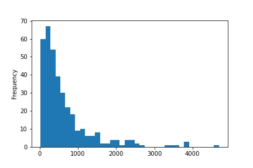

# Описание исходных данных

В качестве источника текстов используется сайт http://hyaenidae.narod.ru/.
На сайте отсутствует указания об ограничениях на использование представленных текстов.
Загрузка данных с сайта выполнена автоматизированным способом: скрипт web_scraper.py.
В качестве исходного формата хранения необработанных текстов выбран CSV.

Кол-во произведений (файлов): 360 шт.
Объем занимаемой памяти на диске: 3.01 Мбайт.
Тип данных содержимого файлов: текстовый (не бинарный).

Статистики для неуникальных токенов текста, с удаленными знаками пунктуации:

* Всего токенов - 231687.
* Среднее число токенов в документе - 643.575.
* Медиана - 399.5.
* Минимальное число токенов в документе - 21
* Максимальное число токенов в документе - 4687

График распределения частоты токенов в документах:

